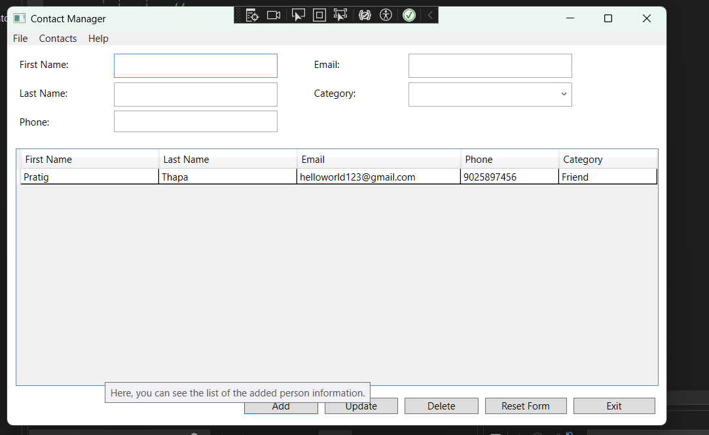

## Contact Manager (WPF / .NET 8 / SQL Server)

A desktop contact management application built with WPF (.NET 8) and SQL Server, demonstrating a clean separation between UI, business/validation logic, and data access.

  


## Overview

Contact Manager lets a user create, view, update, and delete contacts through a WPF form bound to a live `DataGrid`. Unlike a typical CRUD demo, the app is structured around an interface-based repository layer, so the persistence mechanism (currently SQL Server via ADO.NET) can be swapped out without touching the UI or validation code.

## Features

- **Add / Update / Delete** contacts with a form bound to a `DataGrid` via `ObservableCollection<Contact>`
- **Field validation** before any record is added or saved:
  - Required fields (First Name, Last Name, Category) rejected if blank
  - Names rejected if they contain digits
  - Phone numbers validated against a strict 10-digit pattern
  - Emails validated against a standard `local@domain.tld` pattern
  - Validation failures surface as a `MessageBox` instead of crashing the app or silently failing
- **Load / Save workflow**: contacts are loaded from SQL Server on startup and via **File → Reload**, and written back in a single transactional batch via **File → Save** (delete + re-insert, wrapped in a `SqlTransaction` with rollback on failure)
- **Menu-driven actions** (File, Contacts, Help) plus a button toolbar (Add, Update, Delete, Reset Form, Exit)
- **Reset Form** control to clear the input fields without affecting the grid

## Architecture

The project favors a small but real separation of concerns rather than putting everything in the code-behind:

```
MainWindow.xaml / MainWindow.xaml.cs   → UI layer: event handlers, ObservableCollection binding
Contact.cs                              → Domain model (POCO)
IContactRepository.cs                   → Persistence contract (GetAll / SaveAll)
SqlContactRepository.cs                 → SQL Server implementation via ADO.NET (Microsoft.Data.SqlClient)
Validators.cs                           → Static validation helpers, throw ArgumentException with user-facing messages
App.config                              → Connection string configuration
```

**Why this matters:** because the UI only depends on `IContactRepository`, a different storage backend (SQLite, a JSON file, an in-memory store for testing, a REST API) can be substituted by writing a new class that implements the interface — no changes needed to `MainWindow`.

## Tech Stack

| Layer | Technology |
|---|---|
| UI Framework | WPF (.NET 8, `net8.0-windows`) |
| Language | C# |
| Data Access | ADO.NET via `Microsoft.Data.SqlClient` |
| Database | SQL Server / LocalDB |
| Validation | Custom regex-based validators (`System.Text.RegularExpressions`) |

## Getting Started

### Prerequisites

- Windows with .NET 8 SDK
- Visual Studio 2022 (or later) with the WPF workload
- SQL Server or SQL Server LocalDB

### Database Setup

Create the database and table referenced by `App.config`:

```sql
CREATE DATABASE ContactsDb;
GO

USE ContactsDb;
GO

CREATE TABLE Contacts (
    Id        INT IDENTITY(1,1) PRIMARY KEY,
    FirstName NVARCHAR(100) NOT NULL,
    LastName  NVARCHAR(100) NOT NULL,
    Email     NVARCHAR(255) NOT NULL,
    Phone     NVARCHAR(50)  NULL,
    Category  NVARCHAR(100) NOT NULL
);
```

### Configuration

Update the connection string in `App.config` to point at your SQL Server instance:

```xml
<connectionStrings>
  <add name="ContactsDb"
       connectionString="Data Source=localhost;Initial Catalog=ContactsDb;Integrated Security=True;TrustServerCertificate=True;"
       providerName="System.Data.SqlClient" />
</connectionStrings>
```

### Run

1. Open `Assignment4_ContactManager.sln` in Visual Studio
2. Restore NuGet packages (`Microsoft.Data.SqlClient`)
3. Set `Assignment4_ContactManager` as the startup project
4. Press **F5**

## Usage

1. Fill in First Name, Last Name, Phone, Email, and Category
2. Click **Add** to append the contact to the in-memory grid
3. Select a row to edit it, make changes, and click **Update**
4. Select a row and click **Delete** to remove it
5. Use **File → Save** to persist all changes to the database, or **File → Reload** to discard unsaved changes and reload from SQL Server

## Known Limitations / Roadmap

These are honest gaps worth calling out rather than hiding — and doubling as a to-do list:

- [ ] `SaveAll` currently deletes and re-inserts every row rather than diffing changes; fine for a small personal contact list, not for concurrent multi-user use
- [ ] No duplicate-contact detection
- [ ] Category is currently a free-text/dropdown field with no enforced list stored in the database
- [ ] No unit tests yet — `Validators` and `SqlContactRepository` (behind the `IContactRepository` interface, mockable) are the natural first targets
- [ ] No async/await on database calls — UI thread blocks during Load/Save on larger datasets
- [ ] Connection string is stored in plaintext in `App.config` — fine for a local/course project, not for shipping

## Project Context

Built as an OOP/desktop applications assignment (COSC 2100) to demonstrate WPF data binding, input validation, and the repository pattern over ADO.NET.
