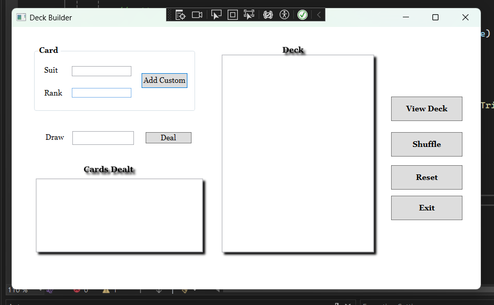
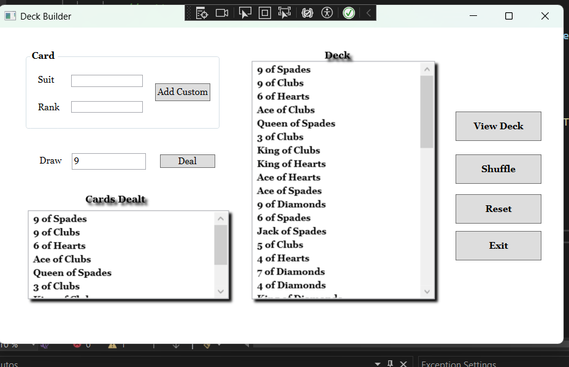

# Deck Builder (WPF / .NET / C#)

A desktop card deck simulator built with WPF, demonstrating inheritance, polymorphism, and encapsulation through a small but real class hierarchy — not just a UI over a list.

 



## Overview

Deck Builder starts with a full, standard 52-card deck and lets the user shuffle it, deal a variable number of cards, add their own custom cards (e.g. jokers, tarot-style cards, or anything with a suit/rank), and view the current state of the deck at any time. The interesting part isn't the buttons — it's the object model underneath them.

## Features

- **Standard 52-card deck** generated automatically on load (4 suits × 13 ranks)
- **Shuffle** using the Fisher-Yates algorithm for a properly uniform random order
- **Deal** any number of cards from the top of the deck, with validation that the amount is a positive number and doesn't exceed what's left
- **Add Custom Card** to append arbitrary suit/rank cards to the deck at runtime
- **View Deck** to inspect the full remaining deck at any point
- **Reset** to discard all changes and start over with a fresh standard deck
- Friendly `MessageBox` validation errors instead of silent failures or crashes

## Architecture

The project is built around a small class hierarchy rather than one big code-behind file:

```
Card.cs           → Value object: Suit + Rank, overridden ToString()
Deck.cs           → Base class: holds the card list, Shuffle(), Deal(n), Clear(), AddCard()
StandardDeck.cs   → Deck subclass: constructor auto-populates all 52 standard cards
CustomDeck.cs     → Deck subclass: adds AddCustomCard(suit, rank) for one-off cards
MainWindow.xaml.cs→ UI layer: wires buttons to deck operations, handles input validation
```

**Why this matters:** `Deck` defines the shared behavior (shuffle, deal, clear) once. `StandardDeck` and `CustomDeck` each specialize it differently — one auto-fills itself, the other exposes a method to add ad-hoc cards — without duplicating any of the shuffle/deal logic. It's a clean, minimal example of inheritance solving a real problem instead of being bolted on for a grade.

## Tech Stack

| Layer | Technology |
|---|---|
| UI Framework | WPF (.NET, Windows) |
| Language | C# |
| Randomization | Fisher-Yates shuffle (`System.Random`) |
| Data Binding | `ListBox.ItemsSource` bound directly to `List<Card>` |



## Getting Started

### Prerequisites

- Windows with the .NET SDK matching the project's target framework
- Visual Studio 2022 (or later) with the WPF workload

### Run

1. Open `Assignment_3_Deck_Builder.sln` in Visual Studio
2. Set `Assignment_3_Deck_Builder` as the startup project
3. Press **F5**

## Usage

1. The app opens with a fresh, ordered 52-card deck
2. Click **Shuffle** to randomize the order
3. Enter a number in **Draw** and click **Deal** to remove that many cards from the top and display them under "Cards Dealt"
4. Enter a **Suit** and **Rank** and click **Add Custom** to insert a new card into the deck
5. Click **View Deck** at any time to refresh and see what's left
6. Click **Reset** to discard everything and start over with a clean standard deck

## Known Limitations / Roadmap

- [ ] No persistence — the deck resets every time the app closes; could be extended to save/load a deck state to disk or a database
- [ ] `AddCustomCard` doesn't validate suit/rank against a known list, so typos or duplicate cards are allowed by design (intentional flexibility, but worth flagging)
- [ ] No unit tests yet — `Deck.Shuffle()` and `Deck.Deal()` are pure, side-effect-contained methods and would be easy first targets
- [ ] Could be extended with drag-and-drop card visuals instead of text lists, or built into a simple card game (e.g. War, Blackjack) on top of the existing `Deck` class

## Project Context

Built as an OOP assignment (COSC 2100) to demonstrate class inheritance, encapsulation, and WPF data binding through a practical, self-contained simulation rather than a typical CRUD form.
